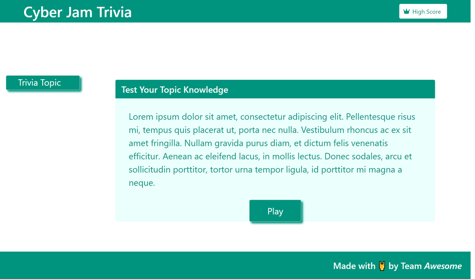
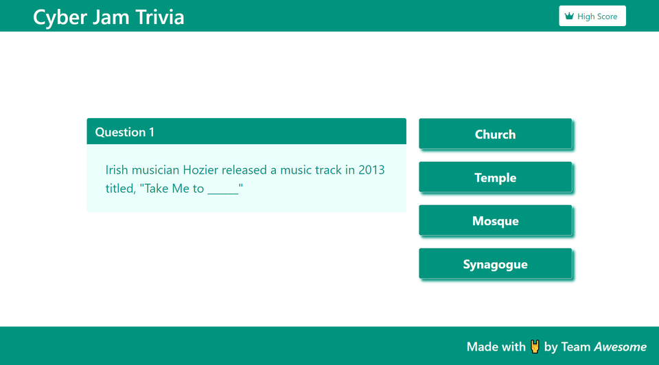
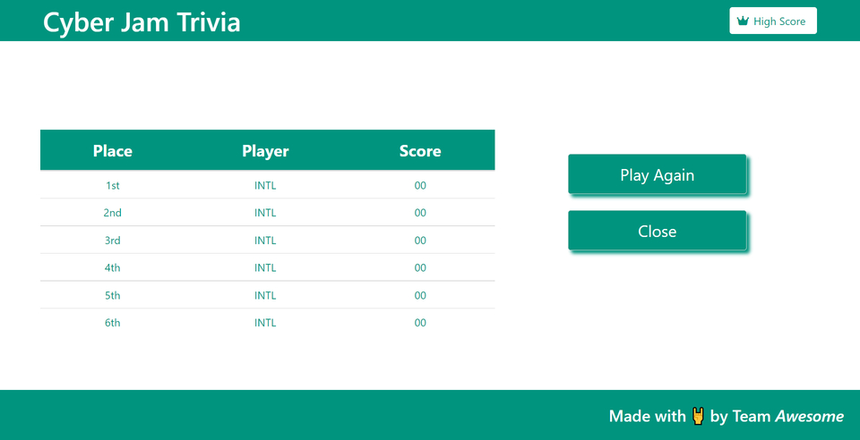

# Cyber Jam Trivia
​
## Description
​
- A trivia website that tests your knowledge of ...!
- You will answer a # of questions under one topic of choice. 
- Once you have gone through all the questions, your score will be saved to local storage.
- The questions are thoroughly randomized. 
- Once the trivia has ended, you will be directed to a page that contains high scores.
​

​
## Application
​
Link to the application:
[Cyber Jam Trivia](https://conniemarie.github.io/trivia/)
​

### Application Screens:
​

### Screenshot of the starting page

### Screenshot of the game page
​

### Screenshot of the high scores page
​

